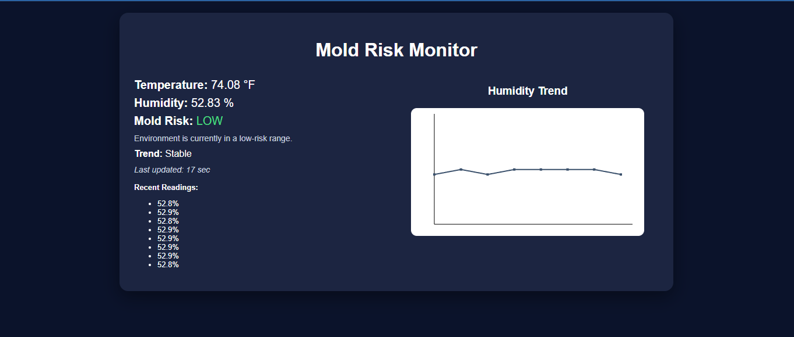

# Mold Growth Risk Predictor  
### Final Project Presentation  

**Idalia Martin**  
CSC 494 – AI-Driven IoT System Development  

---

## Problem

Mold growth often goes unnoticed until it causes:

- Health issues  
- Property damage  
- Expensive repairs  

This happens because environmental conditions like humidity are not continuously monitored.

---

## Goal

Build an IoT system that:

- Monitors temperature and humidity  
- Identifies mold-friendly conditions  
- Displays data in a clear dashboard  
- Helps users understand trends over time  

---

## System Overview

AHT10 Sensor → ESP32 → Web Server → Browser Dashboard  

- Sensor collects data  
- ESP32 processes data  
- Web server displays results  
- User views dashboard in browser  

---

## Hardware

- Seeed Studio XIAO ESP32-C6  
- AHT10 temperature & humidity sensor  
- Breadboard and jumper wires  

---

## Sprint 1 

- Connected AHT10 using I2C  
- Verified sensor with I2C scanner  
- Collected real-time data  
- Converted temperature to Fahrenheit  

---

## Sprint 2 

- Connected ESP32 to WiFi  
- Created web server  
- Built dashboard interface  
- Implemented full system functionality  

---

## Features

- Real-time temperature and humidity  
- Mold risk classification  
- Trend detection (Rising / Falling / Stable)  
- Recent readings history  
- Humidity graph visualization  

---

## Mold Risk Logic

- Low: < 60% humidity  
- Moderate: 60–70%  
- High: > 70%  

Provides quick understanding of environmental risk

---

## Trend Detection

System compares recent readings:

- Rising 
- Falling 
- Stable 

Helps identify changes over time

---

## Dashboard Design

- Clean and simple layout  
- Horizontal structure (data + graph)  
- Consistent color palette  
- User-friendly interface  

---

## Demo – Dashboard

---

## Demo Video

[Click here to watch the demo video](video_demo_mold_risk_monitor.mp4)

---

## Challenges & Solutions

- Sensor not detected → fixed wiring  
- WiFi connection issues → verified setup  
- CSS not applying → fixed HTML structure  

---

## Learning with AI

AI helped with:

- Debugging hardware and software  
- Understanding I2C communication  
- Building web dashboard  
- Creating graph visualization  
- Improving UI design  

---

## Final Outcome

- Fully working IoT system  
- Real-time environmental monitoring  
- Web-based dashboard  
- Trend analysis and visualization  

---

## Future Improvements

- Long-term data storage  
- Alerts for high humidity  
- Mobile-friendly design  
- Advanced data analysis  

---

## Thank You!

Questions?